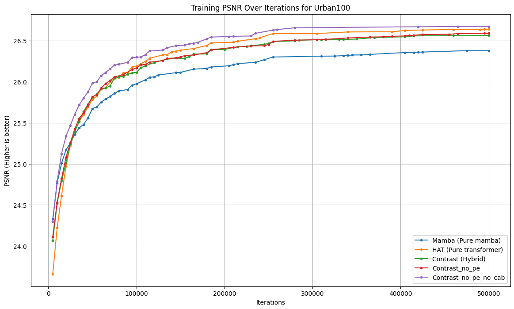
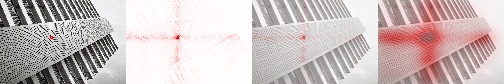
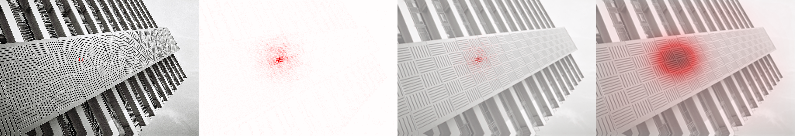
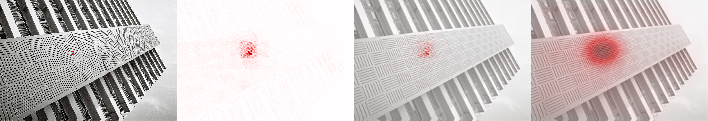
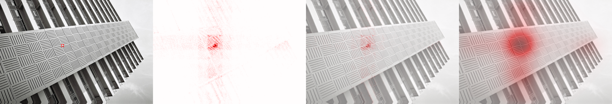
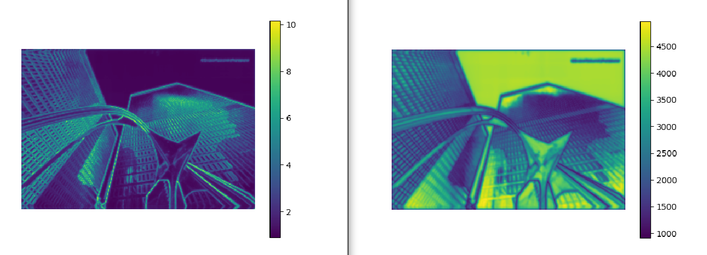
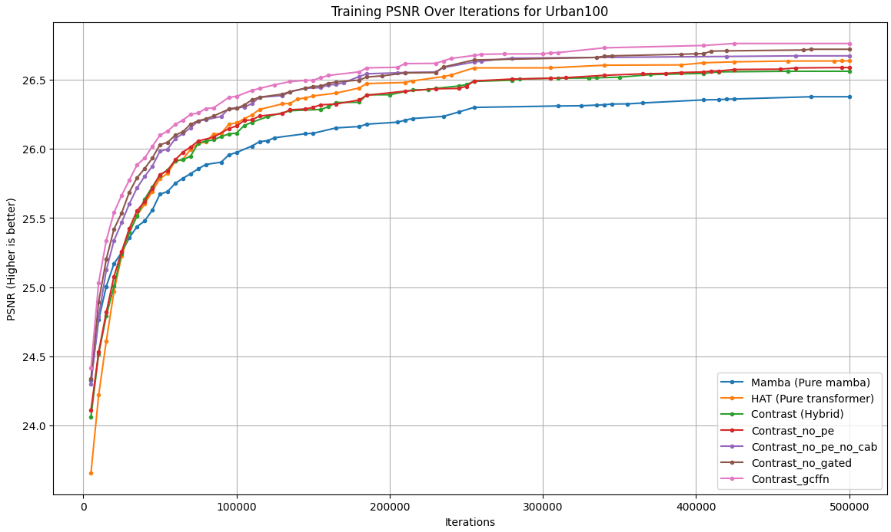

Plans and hypothesis

# Ideas, that haven't tested yet
- Use mamba-2 insted of mamba-1 blocks

# Tested ideas, that don't worth additional work now
- I need to add registers in model. New thought: Its very hard to implement in vmamba blocks registers, because they use 2D input, not 1D as a transformers or VIM
- Replace Softmax to Clipped Softmax as in this [paper](https://arxiv.org/abs/2306.12929). New thought: It makes model slower by 20%, not worth it
- Try to use Windows in some Mamba blocks to better manage diagonal information on images. New thought: Its decrease the model capability, overlap cross attention blocks from Contrast have already managed well with problem with diagonal information.
- Probably use Multi-Query Attention(MQA). New thought: basically don't worth it, because window attention is already very powerful

Thesis Findings on Hybrid Transformer and Mamba Architecture

1. **Pure Mamba Performance**:
   - **Finding**: Pure Mamba architecture performs poorly, as expected, due to its limited ability to accurately copy information. Its architecture relies on compressed and hidden representations, which only allow for approximate copying.
   - **Explanation**: The inherent design of Mamba, with its focus on compressed representations, restricts its precision in copying data, leading to suboptimal performance.

2. **Positional Embeddings in Hybrids**:
   - **Finding**: The hybrid architecture can perform equally well without positional embeddings (PE) as with them. Mamba blocks can learn to encode pixel position information for transformer blocks, but this requires time. Initially, models with PE perform better, but eventually, the performance equalizes, with a slight advantage for models without PE.
   - **Explanation**: Omitting PE accelerates the model and slightly enhances its accuracy. This finding suggests that Mamba blocks can compensate for the lack of positional information, though this learning process impacts early training phases.

3. **Channel Attention Block (CAB) Removal**:
   - **Finding**: Removing the Channel Attention Block improves performance. The parameters freed up by removing CAB can be reallocated to other parts of the model, resulting in higher accuracy.
   - **Explanation**: The reallocation of parameters previously used by CAB to other model components enhances overall performance, making the architecture more efficient.

4. **Attention Blocks Enhancing Mamba**:
   - **Finding**: Adding attention blocks after several Mamba layers (6 in this case) significantly boosts performance. The attention blocks mitigate the weaknesses of Mamba, resulting in a powerful combination that achieves high performance and accuracy.
   - **Explanation**: Attention blocks compensate for the limitations of Mamba, creating a hybrid that trains faster by approximately 25% on Set5 benchmarks and achieves similar PSNR. Further tests on other benchmarks and inference speed comparisons are planned, expecting an increased performance gap in inference.

Baseline is a HAT with (S)W-MSA replaced by SS2D blocks from VMambaV2 

Its the number of parameters of this models:
| Model | Parameters |
|----------|----------|
| baseline | 745,572 |
| baseline_no_pe | 718,194 |
| baseline_no_pe_no_cab | 764,202 |
| mamba(pure) | 759,108 |
| hat_light | 771,099 |

# full plot

  

My main motivation:

One of the primary issues with transformers is their quadratic computational complexity, which was addressed by introducing window mechanisms, achieving sub-quadratic complexity. However, the weak connection between attention windows remains problematic. Meanwhile, the Mamba architecture is emerging as a strong contender due to its low computational complexity. Yet, it too has its drawbacks, particularly in handling diagonal information due to its sequential scanning of images. To illustrate this, I visualized it through LAM, which shows that pure Mamba has distinctly horizontal and vertical lines. Additionally, Mamba struggles to transfer precise information, relying only on approximate data, which is evident in NLP tasks where Mamba excels at rough text summarization but fails in tasks requiring verbatim copying. I believe that a symbiosis of these architectures works best, as they complement each other rather than replace one another. A hybrid architecture can compensate for the limitations of both.

Mamba LAM visualisation:

  

HAT (Pure transformer):

  

Contrast (Hybrid):

  

Contrast_no_pe_no_cab (Hybrid), my current baseline:

  

Here are the points I am considering in the paper (though the list is still evolving as certain hypotheses prove or disprove themselves):

1. I want to start by examining the optimal number of Mamba and transformer blocks. Based on other works, I predict this to be around 5:1 or 6:1 (Mamba: Transformer). (I plan to launch a few training sessions soon to confirm this). I replaced the standard (SW)-MHSA with Mamba blocks in the HAT model.

2. I aim to show how the hybrid architecture resolves the issues of both, resulting in higher throughput and better metrics. (This is currently being supported by our practical experiments. An we can see bigger and "better" receptive field on my LAM visualizations)

3. I also demonstrate that the hybrid architecture improves the recovery of certain elements. Previously, information transitioned very slowly between attention windows, but now Mamba blocks can easily and layer-by-layer transfer one semantic piece of information to far corners of the image, which was previously impossible due to the attention window size. This is one reason for the higher metrics compared to the pure transformer. (Look at LAM maps)

4. I discovered today that the conclusions in https://arxiv.org/pdf/2404.00722#https%3A//github.com/ming053l/DRCT are not entirely accurate. They won the Best Paper Award on CVPRW NTIRE this year because they managed to overcome the problem of large value spikes in modern architectures using a technique from RRDBNet, specifically multiplying the output of a large Dense Skip Connection block by 0.2. While I’m not a fan of this approach, as it artificially reduces values, it helped them deal with outliers with some scaling, but its do not solve with problem. I approached it differently by training a baseline model and then removing the normalization layer before conv_after_body at the very end. I noticed that this normalization layer is used in all modern architectures. I concluded that the large spikes might result from the network trying to highlight certain features, but the final normalization prevents it from doing so effectively. Removing this single layer allowed me to stabilize the feature map on each layer. The metrics improved after a run, and my approach is likely better than theirs, especially when scaling up. I consider this improvement significant as it highlights a potential architectural flaw in most modern models. I’ve attached a screenshot of the L2 normalized feature map from the same network layer to support my claims.

On the right side the baseline and on the left side with my change

  

5. I also worked on the FFN, adding information localization through DWConv, which significantly enhanced the model’s training capabilities without increasing the number of parameters. This can be seen in the graph. The model Contrast_no_pe_no_cab is the baseline, and Contrast_no_gated is the model with DWConv added. The latter continued training at the end, likely indicating greater long-term training potential. Adding the GEGLU mechanism also helped. I compared increasing the mlp_ratio versus using GEGLU, and the latter proved more beneficial in terms of added parameters and metric improvement. However, this last point needs further testing. This improvement seems to offer a slight performance boost.

  

Further experiments might reveal additional findings.

I didn't check their PSNR reproducibility, we need to recheck HAT and DRCT, because they can be incorrect. Large models trained with ImageNet

| Model | Parameters | Set5(x4) PSNR(dB) |
|----------|----------|----------|
| Contrast-S(current) | 6.9M | 32.90 |
| HAT-S | 9.6M | 32.92 |
| SwinIR | 11.9M | 32.92 |
| HAT | 20.8M | 33.04 |
| DRCT | 14.1M | 33.11 |
| CAT | 16.6M | 33.08 |
| DAT | 14.8M | 33.08 |
| RGT | 13.37M | 33.12 |
| HAT-L | 40.8M | 33.30 |
| DRCT-L | 27.6M | 33.37 |
