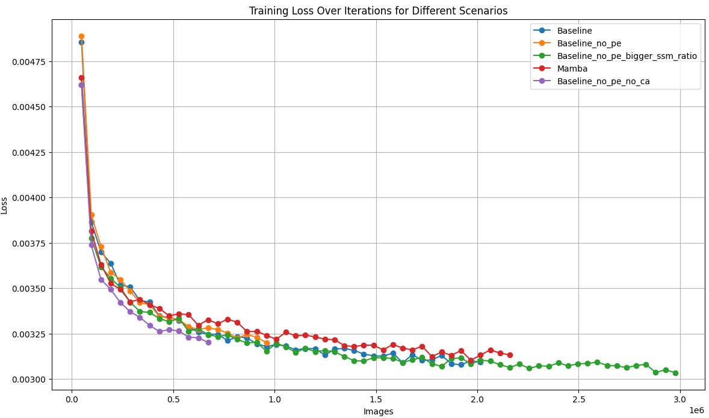

Baseline is a HAT with (S)W-MSA replaced by SS2D blocks from VMambaV2 

<details>
<summary>Contrast baseline initialization:</summary>
  
```
model = Contrast(
        img_range=1., resi_connection='1conv', window_size=16, overlap_ratio=0.5,
        depths=[6, 6, 6, 6], num_heads=[6, 6, 6, 6],
        patch_size=1, in_chans=3, num_out_ch=3, dims=60, upscale_dims=48,
        ssm_d_state=1, ssm_ratio=1.0, ssm_dt_rank="auto", ssm_act_layer="gelu",
        ssm_conv=3, ssm_conv_bias=False,
        ssm_init="v2", forward_type="v05_noz", 
        mlp_ratio=2.0, mlp_act_layer="gelu", gmlp=False,
        patch_norm=True, norm_layer=nn.LayerNorm,
        downsample_version="v3", patchembed_version="v2", 
        use_checkpoint=False, posembed=False, img_size=64, 
        upsampler='pixelshuffledirect', upscale=4, channel_first=False
    )
```
  
</details>

I've made the comparison in training with batch size 8 and patch size 64 of low-resolution image for X4 task on my RTX 3060:

<details>
<summary>HAT-light hyperparameters details:</summary>
  
```
Same depth-1, num_head-1, window_size, dims, upscaler and other details as my baseline Contrast
```
  
</details>

I've made the training and saved model weights and metrics for each ∼48 000 images, trained with MSELoss and Adam(lr=2e-4)

For Contrast_no_pe_no_ca I've removed positional embeddings and channel attention and added more layers to save amount of parameters(∼1.5M). Also I want to mention, that I made different amount of training so that's why the lines are different lengths.

Its the number of parameters of this models:
baseline - 1,491,300
baseline_no_pe - 1,454,796
baseline_no_pe_bigger_ssm_ratio - 1,718,316
mamba - 1,493,508
baseline_no_pe_no_ca - 1,577,388

<p align="center">
  
</p>
